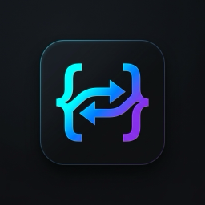

<p align="center">
  
</p>

<h1 align="center">Logical CSS</h1>

[](https://marketplace.visualstudio.com/items?itemName=sazedul-haque.logical-css)
[](https://marketplace.visualstudio.com/items?itemName=sazedul-haque.logical-css)
[](https://marketplace.visualstudio.com/items?itemName=sazedul-haque.logical-css)
[](LICENSE)

A production-quality Visual Studio Code extension that helps developers write RTL-friendly and CSS Logical Property–aware styles by analyzing CSS/SCSS and providing diagnostics, quick fixes, and optional auto-fixes.

## Features

- **Real-time Diagnostics**: Detects physical CSS properties that should be replaced with logical properties
- **Quick Fixes**: One-click conversion from physical to logical properties (Ctrl+. / Cmd+.)
- **Hover Information**: Shows logical property suggestions when hovering over physical properties
- **Status Bar**: Displays current issue count at a glance
- **Ignore Comments**: Support for `/* rtl-ignore */` and `/* rtl-ignore-next-line */`
- **Configurable**: Extensive settings to customize behavior
- **Multi-language Support**: Works with CSS, SCSS, Less, Vue, Svelte, HTML, and JavaScript/TypeScript files

## Installation

### From Visual Studio Marketplace

1. Open VS Code
2. Go to Extensions (Ctrl+Shift+X / Cmd+Shift+X)
3. Search for "Logical CSS"
4. Click Install

### From .vsix File

```bash
# Download the .vsix file from the releases page
code --install-extension logical-css-1.0.0.vsix
```

## Usage

### Diagnostics

The extension automatically analyzes your CSS files and highlights physical properties:

```css
/* Before */
.button {
  margin-left: 10px;
  padding-right: 20px;
  text-align: left;
}

/* After (with quick fix) */
.button {
  margin-inline-start: 10px;
  padding-inline-end: 20px;
  text-align: start;
}
```

### Quick Fixes

When you see a diagnostic, press `Ctrl+.` (Windows/Linux) or `Cmd+.` (macOS) to see available quick fixes:

- Replace `margin-left` with `margin-inline-start`
- Replace `margin-right` with `margin-inline-end`
- Replace `padding-left` with `padding-inline-start`
- Replace `padding-right` with `padding-inline-end`
- Replace `left` with `inset-inline-start`
- Replace `right` with `inset-inline-end`
- And many more...

### Hover Information

Hover over any physical property to see the suggested logical alternative:

```
Physical property

Consider using: margin-inline-start

Reason: Use margin-inline-start for RTL support

---

Logical properties automatically adapt to RTL and writing modes.
```

### Ignore Comments

Use ignore comments to suppress diagnostics for specific lines:

```css
/* rtl-ignore */
.button {
  margin-left: 10px;
}

/* rtl-ignore-next-line */
.sidebar {
  padding-right: 20px;
}
```

## Settings

### logicalCss.enable

- **Type**: `boolean`
- **Default**: `true`
- **Description**: Enable Logical CSS diagnostics

### logicalCss.enableQuickFix

- **Type**: `boolean`
- **Default**: `true`
- **Description**: Enable quick fix code actions

### logicalCss.severity

- **Type**: `string`
- **Enum**: `error`, `warning`, `info`, `hint`
- **Default**: `warning`
- **Description**: Severity level for diagnostics

### logicalCss.ignoreProperties

- **Type**: `array`
- **Default**: `[]`
- **Description**: List of CSS properties to ignore

Example:
```json
{
  "logicalCss.ignoreProperties": ["margin-left", "padding-right"]
}
```

### logicalCss.ignoreValues

- **Type**: `array`
- **Default**: `[]`
- **Description**: List of CSS values to ignore

Example:
```json
{
  "logicalCss.ignoreValues": ["left", "right"]
}
```

### logicalCss.enableHover

- **Type**: `boolean`
- **Default**: `true`
- **Description**: Enable hover information for physical properties

### logicalCss.enableStatusBar

- **Type**: `boolean`
- **Default**: `true`
- **Description**: Enable status bar item

### logicalCss.autoFixOnSave

- **Type**: `boolean`
- **Default**: `false`
- **Description**: Auto-fix issues on save

### logicalCss.checkBlockProperties

- **Type**: `boolean`
- **Default**: `false`
- **Description**: Check physical block-axis properties (`top`, `bottom`, `margin-top`, `padding-bottom`, `border-top`, etc.) and suggest logical equivalents (`inset-block-start`, `margin-block`, etc.)

### logicalCss.checkSizeProperties

- **Type**: `boolean`
- **Default**: `false`
- **Description**: Check sizing properties (`width`, `height`, `min-width`, etc.) and suggest logical sizing (`inline-size`, `block-size`, etc.)

### logicalCss.checkShorthands

- **Type**: `boolean`
- **Default**: `true`
- **Description**: Detect physical shorthand declarations (e.g. 4-value `padding: 10px 20px 10px 30px`) that have asymmetric horizontal values and require logical properties for RTL support

## Commands

### Logical CSS: Scan Workspace

Scans all CSS files in the current workspace and reports the total number of issues.

### Logical CSS: Scan Current File

Scans the currently active file and reports issues.

### Logical CSS: Scan Folder

Scans all stylesheets (`.css`, `.scss`, `.less`) within a selected folder and reports issues in the Problems panel. Can be executed by right-clicking any directory in the VS Code File Explorer and selecting **Logical CSS: Scan Folder**, or from the Command Palette (`Cmd+Shift+P` / `Ctrl+Shift+P`).

## Supported Properties

### Inline / Horizontal Properties (Default)

| Physical | Logical |
|----------|---------|
| `margin-left` | `margin-inline-start` |
| `margin-right` | `margin-inline-end` |
| `padding-left` | `padding-inline-start` |
| `padding-right` | `padding-inline-end` |
| `left` | `inset-inline-start` |
| `right` | `inset-inline-end` |
| `border-left` | `border-inline-start` |
| `border-right` | `border-inline-end` |
| `border-left-width` / `style` / `color` | `border-inline-start-*` |
| `border-right-width` / `style` / `color` | `border-inline-end-*` |
| `border-top-left-radius` | `border-start-start-radius` |
| `border-top-right-radius` | `border-start-end-radius` |
| `border-bottom-left-radius` | `border-end-start-radius` |
| `border-bottom-right-radius` | `border-end-end-radius` |
| `scroll-margin-left` / `right` | `scroll-margin-inline-start` / `end` |
| `scroll-padding-left` / `right` | `scroll-padding-inline-start` / `end` |
| `overflow-x` | `overflow-inline` |

### Block / Vertical Properties (Opt-in via `logicalCss.checkBlockProperties`)

| Physical | Logical |
|----------|---------|
| `margin-top` | `margin-block-start` |
| `margin-bottom` | `margin-block-end` |
| `padding-top` | `padding-block-start` |
| `padding-bottom` | `padding-block-end` |
| `top` | `inset-block-start` |
| `bottom` | `inset-block-end` |
| `border-top` | `border-block-start` |
| `border-bottom` | `border-block-end` |
| `border-top-width` / `style` / `color` | `border-block-start-*` |
| `border-bottom-width` / `style` / `color` | `border-block-end-*` |
| `scroll-margin-top` / `bottom` | `scroll-margin-block-start` / `end` |
| `scroll-padding-top` / `bottom` | `scroll-padding-block-start` / `end` |
| `overflow-y` | `overflow-block` |

### Sizing Properties (Opt-in via `logicalCss.checkSizeProperties`)

| Physical | Logical |
|----------|---------|
| `width` | `inline-size` |
| `height` | `block-size` |
| `min-width` | `min-inline-size` |
| `max-width` | `max-inline-size` |
| `min-height` | `min-block-size` |
| `max-height` | `max-block-size` |

### Direction-Sensitive Values

| Property | Physical Value | Logical Value |
|----------|---------------|---------------|
| `text-align` | `left` | `start` |
| `text-align` | `right` | `end` |
| `float` | `left` | `inline-start` |
| `float` | `right` | `inline-end` |
| `clear` | `left` | `inline-start` |
| `clear` | `right` | `inline-end` |
| `background-position` | `left` | `inline-start` |
| `background-position` | `right` | `inline-end` |
| `transform-origin` | `left` | `inline-start` |
| `transform-origin` | `right` | `inline-end` |
| `caption-side` | `left` / `right` | `inline-start` / `inline-end` |
| `resize` | `horizontal` / `vertical` | `inline` / `block` |

## Why Logical Properties?

Logical properties are a modern CSS feature that automatically adapt to the document's writing direction and mode. This makes it much easier to build internationalized (i18n) applications that support both left-to-right (LTR) and right-to-left (RTL) languages.

### Benefits

- **RTL Support**: Automatically works in RTL languages (Arabic, Hebrew, etc.)
- **Writing Mode Support**: Works with vertical writing modes
- **Less Code**: No need for separate RTL stylesheets
- **Maintainability**: Easier to reason about layout direction
- **Future-Proof**: Follows modern CSS best practices

## Contributing

Contributions are welcome! Please follow these steps:

1. Fork the repository
2. Create a feature branch (`git checkout -b feature/amazing-feature`)
3. Commit your changes (`git commit -m 'Add amazing feature'`)
4. Push to the branch (`git push origin feature/amazing-feature`)
5. Open a Pull Request

### Development

```bash
# Install dependencies
npm install

# Compile TypeScript
npm run compile

# Run tests
npm test

# Run tests with coverage
npm run test:coverage

# Lint code
npm run lint

# Fix linting issues
npm run lint:fix

# Format code
npm run format

# Package extension
npm run package
```

## License

MIT License - see [LICENSE](LICENSE) file for details.

## Changelog

See [CHANGELOG.md](CHANGELOG.md) for a list of changes in each version.

## Support

- **Issues**: [GitHub Issues](https://github.com/sazedul-haque/logical-css/issues)
- **Documentation**: [GitHub Wiki](https://github.com/sazedul-haque/logical-css/wiki)

## Acknowledgments

- Built with [PostCSS](https://postcss.org/)
- Inspired by the CSS Logical Properties specification
- Thanks to all contributors

---

**Made with ❤️ for the international web**
